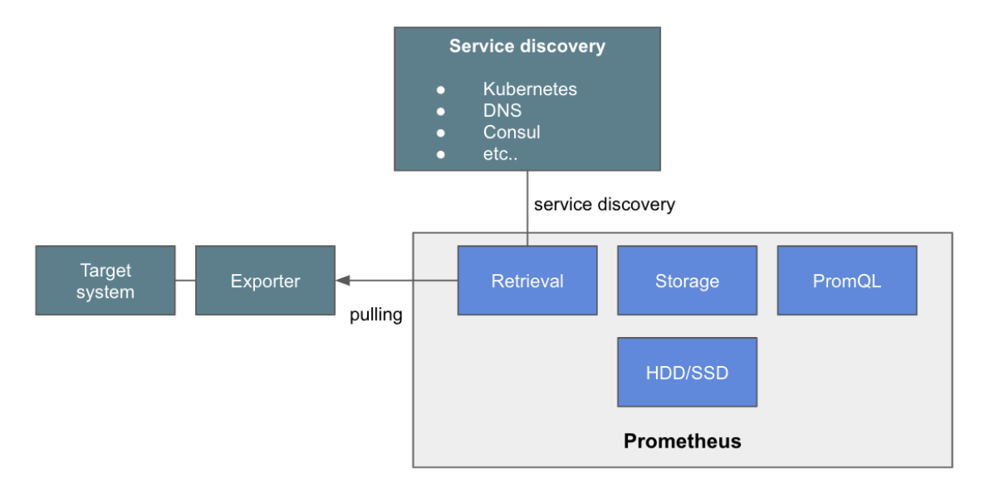
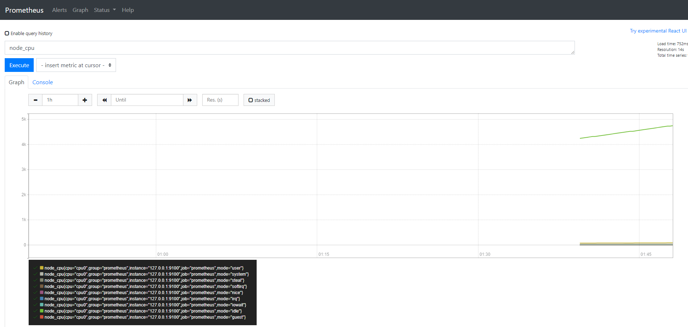
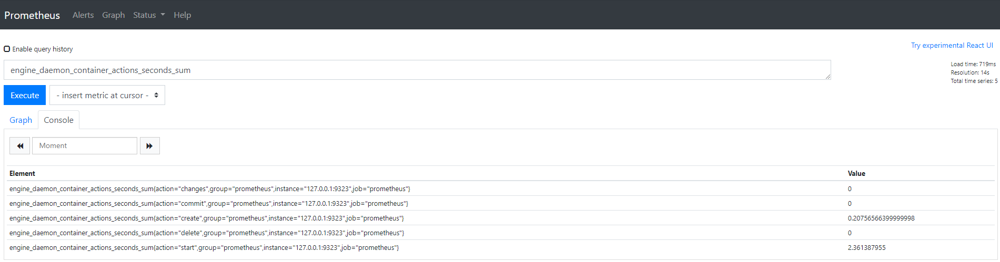
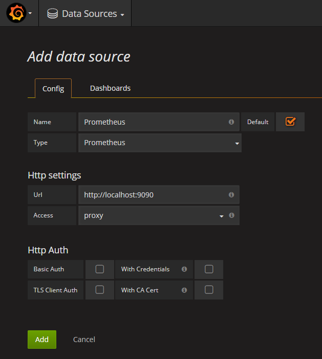
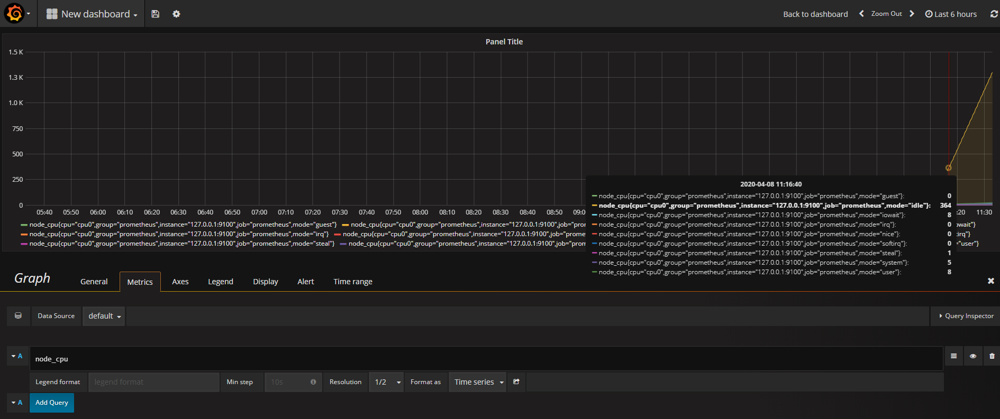
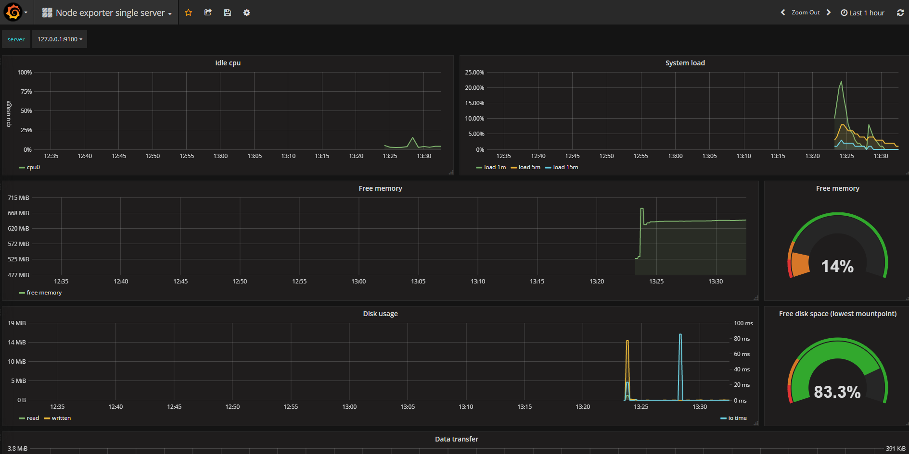

# Monitoring
오픈 소스 기반의 모니터링 시스템인 Prometheus에 대한 기본 개념과 실습 (using Katacoda)

- 오픈 소스 기반의 모니터링 시스템
- 관리 대상 시스템으로 부터 각종 모니터링 지표를 수집하여 저장하고 검색할 수 있는 시스템
- 구조가 간단해서 운영이 쉽고, 강력한 쿼리 기능을 가지고 있으며, Grafana를 통한 시각화를 지원한다.
- 넓은 오픈 소스 생태계를 기반으로 많은 시스템을 모니터링할 수 있는 다양한 플러그인을 가지고 있다. 
- 특히 k8s의 메인 모니터링 시스템으로 많이 사용되면서 요즘 특히 더 주목을 받고 있다.

## ■ Basic Architecture



`√ Metric Collect`
- MySQL이나, Tomcat 또는 VM 과 같은 모니터링 대상에서 metric을 prometheus에 전송하기 위해 `Exporter`를 사용한다.

`√ Pulling`
- prometheus가 주기적으로 Exporter로 부터 메트릭 읽어와서 수집하는 방식
- Autoscaling에 의한 추가된 VM들의 IP를 알 수 없는 경우를 위해 service discovery 방식을 사용한다.

`√ Service Discovery`
- prometheus도 service discovery system과 통합을 하도록 되어 있다. DNS나, service discovery 전용 솔루션인 Hashicorp사의 Consul 또는 k8s를 통해서, target service의 list을 가지고 올 수 있다. 

`√ Exporter`
- Monitoring Agent로 target system에서 metric을 읽어 prometheus가 pulling할 수 있도록 한다.
- HTTP GET으로 해당 metric을 text형태로 return한다.

`√ Retrieval`
- service discovery system으로 부터 monitoring 대상 목록을 받아오고, Exporter로 부터 주기적으로 그 대상으로 부터 metric을 수집하는 module

`√ Storage`
- 수집된 정보는 prometheus내의 memory와 local disk에 저장, 스케일링이 불가한 단점 존재
- 확장이 불가능하고, 저장 용량이 부족하면 디스크 용량을 늘리는 것 밖에 방안이 없다
- 구조상 HA를 위한 이중화나 clustering이 불가

`√ Serving`
- 저장된 metric은 `PromQL`을 이용하여 조회하고, 이를 외부 API나 prometheus Web Console을 이용하여 서빙이 가능

---

## ■ Run (using [](https://www.katacoda.com/))

### Step 1 - Configure Prometheus (prometheus.yml)

```java
global:
  scrape_interval:     15s // target system으로 부터 metric을 읽어오는 주기
  evaluation_interval: 15s // alert을 보낼지 말지 metric을 보고 판단하는 주기

scrape_configs:	// 데이타 수집 대상과 방법을 정의
  - job_name: 'prometheus' // 대상 그룹에서 metric을 수집해오는 내용을 정의

    static_configs:
      - targets: ['127.0.0.1:9090', '127.0.0.1:9100'] // 두 개의 target에서 metric을 수집하도록 하나의 job을 정의 (9090: Prometheus itself, 9100: Node Exporter Prometheus process)
        labels:
          group: 'prometheus'
```

### Step 2 - Start Prometheus Server & Node Exporter

- docker image를 이용한 prometheus server 기동
```bash
> docker run -d --net=host \
    -v /root/prometheus.yml:/etc/prometheus/prometheus.yml \
    --name prometheus-server \
    prom/prometheus
```

- docker image를 이용한 node exporter 기동 (image : quay.io/prometheus/node-exporter)
```bash
> docker run -d \
  -v "/proc:/host/proc" \
  -v "/sys:/host/sys" \
  -v "/:/rootfs" \
  --net="host" \
  --name=prometheus \
  quay.io/prometheus/node-exporter:v0.13.0 \
    -collector.procfs /host/proc \
    -collector.sysfs /host/sys \
    -collector.filesystem.ignored-mount-points "^/(sys|proc|dev|host|etc)($|/)"
```

- node exporter 작동 확인
```bash
> curl localhost:9100/metrics
```

### Step 3 - View Metrics

- `http://{Prometheus Server ip}:9090` 에 접속하면, dashboard가 나오는데, 검색 query 부분에 보고 싶은 metric에 대한 query를 넣으면, table이나 graph 형태로 볼 수 있다.



### Step 4 - Enable Metrics

- metric 기능을 활성화하고 localhost:9323에서 수신할 metric 주소를 정의하는 새 experimental flag를 활성화한다.

```bash
> echo '{ "metrics-addr" : "127.0.0.1:9323", "experimental" : true }' > /etc/docker/daemon.json
> systemctl restart docker
```

- docker가 시작되면 metric endpoint에 access할 수 있다.

```bash
> curl localhost:9323/metrics
```

- prometheus.yml에 target add

```java
...
targets: ['127.0.0.1:9090', '127.0.0.1:9100', '127.0.0.1:9323'] // 9323 is the Docker Metrics port
...
```

### Step 5 - Generate Metrics

```bash
> docker run -d katacoda/docker-http-server:latest
```

- `http://{Prometheus Server ip}:9323` 에 접속



---

### Step 6 - Start Grafana & Login (admin/admin)

```bash
> cd ~ && curl -L -o ~/grafana-4.5.1.linux-x64.tar.gz https://s3-us-west-2.amazonaws.com/grafana-releases/release/grafana-4.5.1.linux-x64.tar.gz && tar -zxvf ~/grafana-4.5.1.linux-x64.tar.gz

> cd ~/grafana-4.5.1/bin/ && ./grafana-server
```

### Step 7 - Import Dashboard [](https://www.katacoda.com/courses/prometheus/creating-dashboards-with-grafana)

- URL을 이용하여 Prometheus server에 Data Source를 추가하여 Prometheus server와 grafana 연결



- Create your first dash board > Panel Title > Edit > Metric > cpu_node 입력



- Prometheus node_exporter에 의해서 제공되는 metric을 monitoring할 수 있는 dashboard를 import하여 사용 가능
- dashboard 설정을 json 파일로 upload할 수 있지만, grafana dashboard website [](https://grafana.com/dashboards) 에 있는 경우에는 아래 처럼 URL이나 dashboard id (ex: `22`)를 넣으면 된다.



